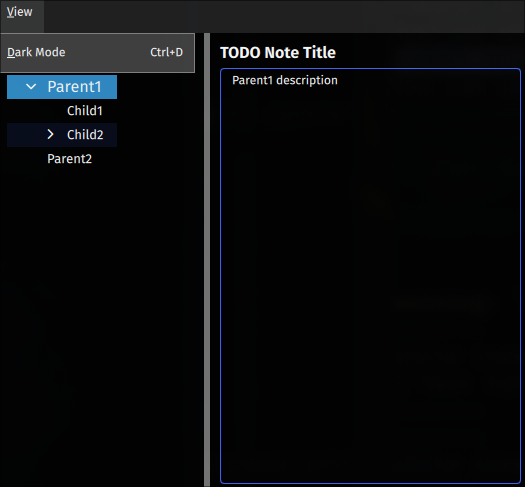

# QML Tree Example With SQLite

This repository serves as an example of a Notetaking application in QMl with a Tree that displays the content of the field.

## Usage

1. Git Clone
2. `cd` into path
2. `uv run gui`

